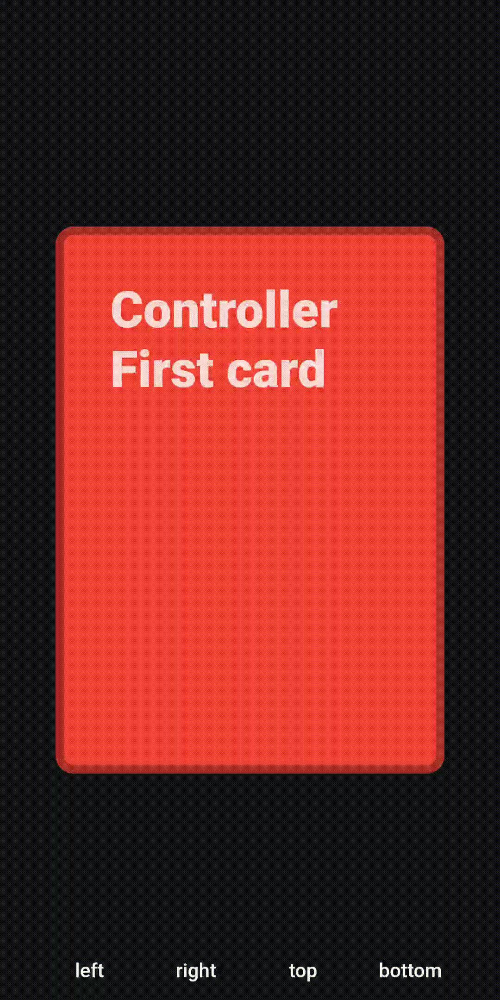

<!-- omit in toc -->
# Swipeable Card (v1.x.x)

**Add swipeable card-like widgets for games or interactive onboarding screens**

[]()
[](http://makeapullrequest.com)

[](https://www.buymeacoffee.com/ninest) 


## Contents
- [Examples](#Examples)
- [Documentation](#Documentation)
- [Issues and limitations](#Issues-and-limitations)
- [Other information](#Other-information)

## 🎮 Examples

### Demo
 

Check the [repository](https://github.com/ninest/swipeable_card) if you're unable to see the demo.

### App examples
Swipeable Widget is used in the following apps:
- [Shots](https://github.com/ninest/Shots)
- Create a PR to add your own!

## 📒 Documentation

### Installation
Add `swipeable_card` to your `pubspec.yaml`:

```
dependencies:
  flutter:
    sdk: flutter

  # added below
  swipeable_card: <latest version>
```

### Adding to your app

The swipeable widget has to be placed in a `Stack`, for example:

```
Stack(
  children: <Widget>[
    SwipeableWidget(
      // parameters ...
      child: someChildWidget(),
    ),
  ],
)
```

In the above example, replace `someChildWidget()` with the widget that can be swiped (for example, a playing card-like widget).

### Parameters

<details>

<summary>
Click to reveal all parameters
</summary>

#### int `animationDuration`
- The animation duration that dictates
  - How long it takes the widget to move back to the origin
  - How long it takes for the widget to animate off the screen

  Default value: `700`

#### double `horizontalThreshold`
- The position the swipeable widget is moved horizontally for it to be moved away. 

  Once the widget is moved beyong this theshold, the function `onHorizontalSwipe` is called.

  This [diagram in this video](https://youtu.be/g2E7yl3MwMk?t=56) may help you visualize the correct position.

  Default value: `0.85`

#### double `verticalThreshold`
- **Not implemented yet.**

  The position the swipeable is moved vertically for it to be moved away.

  Once the widget is moved beyong this theshold, the function `onVerticalSwipe` is called.

  This [diagram in this video](https://youtu.be/g2E7yl3MwMk?t=56) may help you visualize the correct position.

  Default value: `0.95`


#### Function `onLeftSwipe`
- The function called when the card is moved beyond the left side `horizontalThreshold` (in terms of Align). If you're making a card game, this is where you would call the function that calls the next card.

#### Function `onRightSwipe`
- Similar to `onLeftSwipe`

#### SwipeableWidgetController `swipeableWidgetController`
- Controller that can swipe the card automatically (without user interaction).

  The following methods exist:
  - `_swipeableWidgetController.triggerSwipeLeft()`
  - `_swipeableWidgetController.triggerSwipeRight()`

  The below two also exist, but are not yet implemented:
  - `_swipeableWidgetController.triggerSwipeTop()`
  - `_swipeableWidgetController.triggerSwipeBottom()`

#### Widget `child` (required)
- The child widget, which will be swipeable.


#### List<Widget> `children`
- The widgets behind the `child` 

  These can be the other cards if it's a card game.

</details>


### Basic example
```
SwipeableWidget(

  child: CardExample(text: "This is card"),
  nextCards: [
    CardExample(text: "This is the card"),
    CardExample(text: "This is third card"),
  ]
  onLeftSwipe: () => print("Card swiped!"),
  onRightSwipe: () => print("Card swiped!"),
)
```
See the [Example](https://github.com/ninest/swipeable_card/tree/v1.x.x/example) for more details. It contains a detailed write up on how to use the swipeable widget controller too.

## 😐 Issues and limitations

If you use the a `swipeableWidgetController` to automatically swipe the cards (without the user panning), you can only start swiping the next card away when the previous one is fully swiped away. To see a demo, run the example, and continuously tap the "Left" button at the bottom of the screen.

Apart from that, all the other problems from v0.0.x seem to be dealth with.

## 📝 Other information
Project start date: 1 May, 2020.

<!-- This package was extracted from my app [Shots](https://github.com/themindstorm/Shots). Check it out! -->